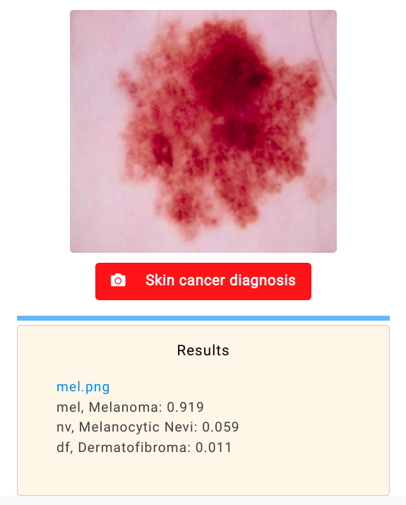

# Automated diagnosis of skin lesions for detection of Skin Cancer

## Project Description

This repository contains files related to Biotech Final Year Project of MNNIT Allahabad, Dept of Biotechnology. The purpose of this project is detection of skin cancer by automatically classifying images of skin lesions into various diagnostic categories using Deep Learning techniques.

### Web app:

[Live web app for automated diagnosis](https://agg-geek.github.io/skincancer/)

### Project Supervisor:

-   Dr. Ashutosh Mani,  
    Associate Professor, Department of Biotechnology

### Project Creator:

-   Abhinav Aggarwal, 20200003  
    Final year B Tech, Biotechnology
